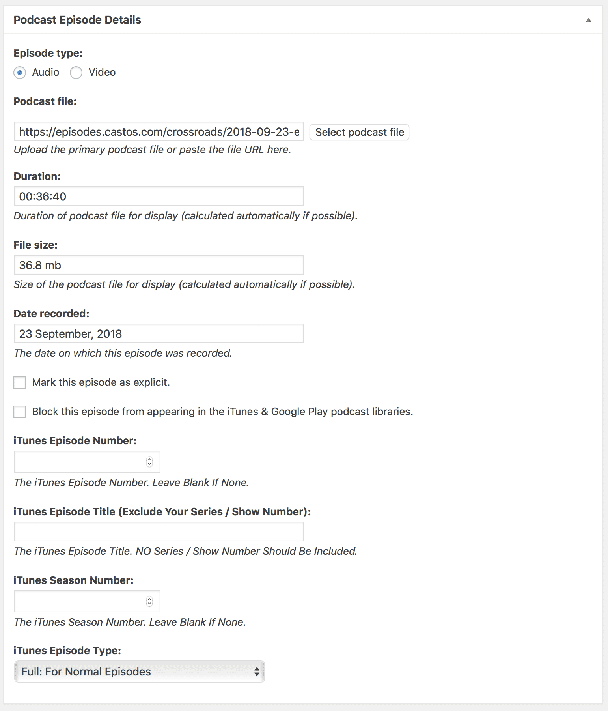

# Uploading Podcasts

When saving out audio files for the Sermons podcast, please follow these guidelines:

## 1) Save your audio in MP3 format

Save your files as MP3s (i.e. `.mp3`).

!!! tip
    Changing a `.wav` file's extention to `.mp3` doesn't make it an MP3. You must chose MP3 as the export file format when you're saving your audio from  your recording program.

## 2) Follow our file naming scheme

Name your files according to this pattern: `YYYY-MM-DD_name-of-the-sermon.mp3`.

Examples:

- `2018-09-09_esther.mp3`

- `2018-08-26_i-declare-love.mp3`

Using the above filename pattern will allow your audio files to "self-sort" when they're listed in together in a directory/folder.

!!! info "File Naming Do's and Don'ts"
    - Only use lowercase letters.
    - Don't use "spaces". Instead, use "underscores" and "dashes".

## 3) Upload your podcast inside WordPress

1. Go to ==Podcast &rarr; Add New==.
2. Enter an ==Episode Title==, select/add a ==Podcast Series==, select/add a ==Speaker==, and enter the ==Podcast Episode Details== in the meta box by the same name.

When entering the ==Podcast Episode Details==, follow these steps:

1. Upload your audio by clicking "Select podcast file". Once your audio finishes uploading, the "Duration" and "File size" fields will be entered automatically. NOTE: If your upload ever fails due to a `cURL` error, simply re-try your upload.
2. Set the "Date recorded"
3. Set the "iTunes Episode Type" as "Full: For Normal Episodes".
4. All other fields should be left blank.

Sample Podcast Episode Details:
