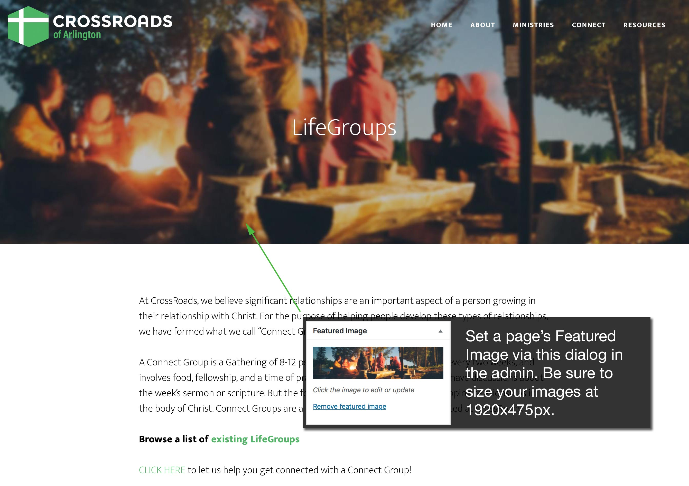
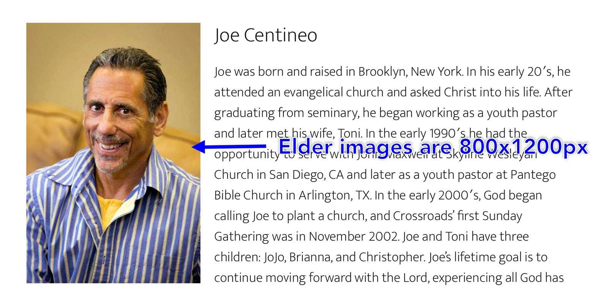
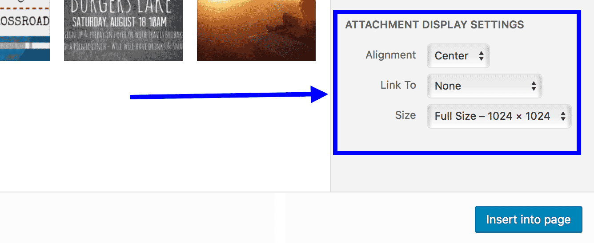

# Working with images on the site

Getting your images ready for use on the site is a matter of authoring them at the correct resolution (i.e. width x height), and saving them out at the proper filesize.

## __1) Featured Images `1920x475px`__

The top title area of each page or blog post can display a large full-width feature image. In your graphics software, author these images at `1920x475px`.

## __2) Elder Headshots `800x1200px`__

When saving elder headshots for the [Elders page](https://www.crossroadsofarlington.org/about/leadership/elders/), save these images at `800x1200px`.

## __3) Body Content Images__

There are no specific rules for saving images for use in your body copy. However, follow these general guidlines:

1. Save your images at twice the resolution they'll be on-screen so that they'll appear crisp on "Retina" or HiDPI displays. Example: If you've got a graphic that will be 800x400px on-screen, author the image at 1600x800px. Then when you insert the image into your page, set the image's width to 800px and the height to 400px. On a HiDPI display, that image will appear extra sharp because you're packing twice the amount of image data into that 800x400px on-screen image.
2. Be sure to use the correct compression scheme (i.e. JPG or GIF/PNG) depending on what type of image you are saving. Save photographs as JPGs, save simple images (i.e. things like drawings, diagrams, or "line art") as GIFs or PNGs.
3. When you're creating your double-resolution images (see 1 above), you max width should be 2400px. That's because the actual width of the site's content area maxs out at 1200px wide at desktop resolutions. Therefore that 2400px wide image will give you a 1200px wide image when you scale it down in the body content.
4. When you're inserting images in WordPress, be aware of your "Attachment Display Settings". For example, if you've authored your image with exact dimensions for HiDPI displays, you'll want to insert the "Full Size" version of your image. Also be aware that WordPress defaults the "Link To" setting to self. Most of the time, you want to change that to "None" as shown in this screenshot:

## __Appendix: Tips on Saving Your Images for the Web__

You want to *try* to keep your Featured Image filesizes at or below 100Kb. This way your images will load quickly on slow connections. Here are some tips on how to do that:

### 1. Use the correct compression scheme (i.e. JPG or GIF/PNG)

If your image is a photograph, save it as a JPEG/JPG. The JPEG file format is made to handle photographic images. On the other hand, if your graphic has few colors and looks more like "line art", save it as a GIF or PNG.

When you're saving out your image, your software should give you a filesize estimate, so experiement with the different compression schemes (i.e. JPG, GIF, or PNG) to see which one provides the best combination of a small filesize and acceptible image quality.

### 2. Add a blur

Adding a blur filter to your images will reduce their filesize when saving out photographs as JPGs. This works great with the ==Featured Images== displayed at the top of pages since you don't want the detail in your image to compete with the page title overlaid on top of it.